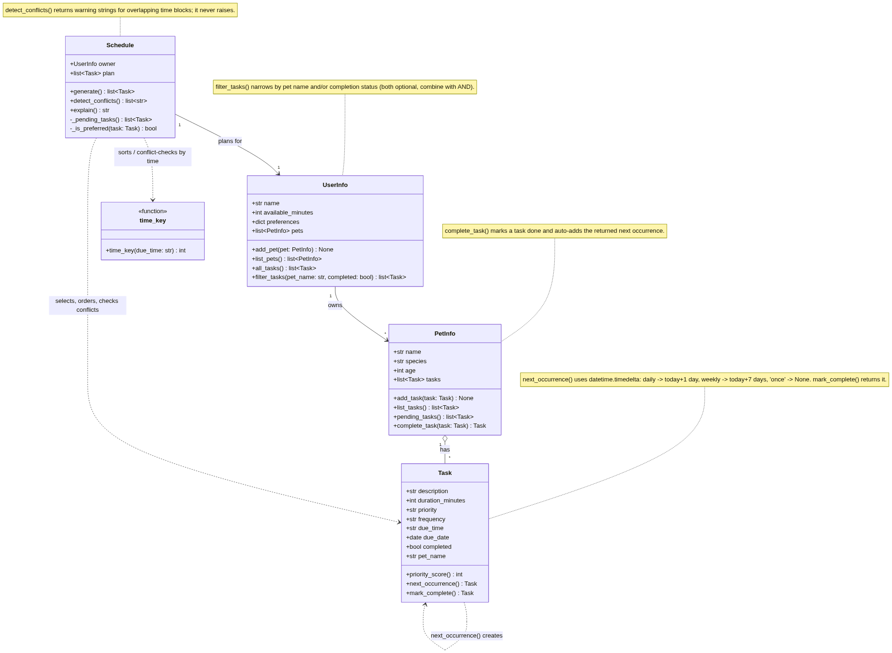

# PawPal+ (Module 2 Project)

You are building **PawPal+**, a Streamlit app that helps a pet owner plan care tasks for their pet.

## ✨ Features

PawPal+ is more than a to-do list — it runs real scheduling algorithms over an
owner's pets and tasks. (Implementation details and method names are in the
[Smarter Scheduling](#-smarter-scheduling) section.)

- **🗓️ Sorting by time** — the daily plan is ordered chronologically, parsing
  `HH:MM` times into minutes so even unpadded times like `9:00` sort correctly
  (before `18:00`), with untimed tasks placed last.
- **🎯 Priority-based selection** — a greedy planner fills the day's time budget,
  ranking tasks by priority, then owner preferences, then duration.
- **⚠️ Conflict warnings** — overlapping time blocks are detected and reported as
  plain-language warnings instead of crashing the program.
- **🔁 Daily & weekly recurrence** — completing a recurring task automatically
  generates its next occurrence (daily → tomorrow, weekly → +7 days) using
  Python's `timedelta`; one-off tasks do not repeat.
- **🔍 Task filtering** — tasks can be filtered by pet and/or completion status.
- **🐾 Multi-pet planning** — one owner can have many pets; the scheduler plans
  across all of them on a single timeline.
- **🧾 Explainable plans** — every plan comes with a readable summary of what was
  scheduled, what conflicts exist, and what was skipped for lack of time.

## Scenario

A busy pet owner needs help staying consistent with pet care. They want an assistant that can:

- Track pet care tasks (walks, feeding, meds, enrichment, grooming, etc.)
- Consider constraints (time available, priority, owner preferences)
- Produce a daily plan and explain why it chose that plan

Your job is to design the system first (UML), then implement the logic in Python, then connect it to the Streamlit UI.

## What you will build

Your final app should:

- Let a user enter basic owner + pet info
- Let a user add/edit tasks (duration + priority at minimum)
- Generate a daily schedule/plan based on constraints and priorities
- Display the plan clearly (and ideally explain the reasoning)
- Include tests for the most important scheduling behaviors

## Getting started

### Setup

```bash
python -m venv .venv
source .venv/bin/activate  # Windows: .venv\Scripts\activate
pip install -r requirements.txt
```

### Suggested workflow

1. Read the scenario carefully and identify requirements and edge cases.
2. Draft a UML diagram (classes, attributes, methods, relationships).
3. Convert UML into Python class stubs (no logic yet).
4. Implement scheduling logic in small increments.
5. Add tests to verify key behaviors.
6. Connect your logic to the Streamlit UI in `app.py`.
7. Refine UML so it matches what you actually built.

## 🖥️ Sample Output

A quick look at the generated plan (see the full run under
[Demo Walkthrough](#-demo-walkthrough)):

```
$ python main.py
Daily plan for Johnte (115/120 min used):
  07:30 — Feeding for Kyle (10 min, daily) [priority: high]
  08:00 — Morning walk for Kyle (30 min, daily) [priority: high]
  08:15 — Feeding for Emmy (10 min, daily) [priority: high]
  12:00 — Vet visit for Kyle (30 min, daily) [priority: high]
  12:15 — Grooming for Emmy (20 min, daily) [priority: medium]
  18:00 — Litter box cleaning for Emmy (15 min, daily) [priority: medium]
```

## 🧪 Testing PawPal+

```bash
# Run the full test suite:
pytest

# Run with coverage:
pytest --cov
```

Sample test output:

```
# Paste your pytest output here
```

## 📐 Smarter Scheduling

PawPal+ goes beyond a flat to-do list. The scheduler sorts, filters, detects
conflicts, and regenerates recurring tasks. Each feature and the method that
implements it is documented below (all live in `pawpal_system.py`).

| Feature | Method(s) | Notes |
|---------|-----------|-------|
| Time sorting | `time_key()` + `Schedule.generate()` | Orders the plan chronologically; handles unpadded/blank times |
| Filtering | `UserInfo.filter_tasks()` | Narrow by pet name and/or completion status |
| Conflict detection | `Schedule.detect_conflicts()` | Warns on overlapping time blocks instead of crashing |
| Recurring tasks | `Task.next_occurrence()`, `Task.mark_complete()`, `PetInfo.complete_task()` | Auto-creates the next daily/weekly instance |

### Sorting behavior

The plan is ordered by time in `Schedule.generate()`, which sorts the chosen
tasks with the `time_key()` helper. `time_key()` converts an `"HH:MM"` string
into minutes-since-midnight, so times sort numerically rather than as text.
This means an unpadded `"9:00"` correctly sorts **before** `"18:00"` (a plain
string sort would put it after), and blank/invalid times fall to the end of the
day. Task *selection* uses a separate ranking (priority, then preferred tasks,
then shorter duration); the `time_key()` sort is purely for chronological order.

### Filtering behavior

`UserInfo.filter_tasks(pet_name="", completed=None)` returns the owner's tasks
narrowed by two optional filters that combine with AND:

- `pet_name` — keep only that pet's tasks (blank = all pets)
- `completed` — `True` for done tasks, `False` for pending, `None` to ignore status

So `owner.filter_tasks(pet_name="Kyle", completed=False)` returns Kyle's pending
tasks. (`PetInfo.pending_tasks()` is the simpler per-pet, pending-only version.)

### Conflict detection logic

`Schedule.detect_conflicts()` performs a lightweight overlap check. It treats
each timed task as a block `[due_time, due_time + duration)`, sorts the timed
tasks chronologically, and flags any pair where a task starts before the
previous one finishes. It is deliberately forgiving: untimed and invalid-time
tasks are skipped, and **it never raises** — it returns a list of human-readable
warning strings (empty when there are no clashes). `Schedule.explain()` prints
these under a "Schedule conflicts:" heading. Because it works across the owner's
whole day, it catches conflicts even between tasks belonging to different pets.

### Recurring task logic

When a `"daily"` or `"weekly"` task is completed, the next occurrence is created
automatically using Python's `timedelta`:

- `Task.next_occurrence()` builds a fresh, not-yet-completed copy with the due
  date rolled forward — `"daily"` → today + 1 day, `"weekly"` → today + 7 days.
  A `"once"` task returns `None` (it does not repeat).
- `Task.mark_complete()` marks the task done and returns that next occurrence.
- `PetInfo.complete_task()` ties it together: it marks the task complete and
  automatically adds the new instance back to the pet's task list.

## 🧭 Class Diagram (UML)

The final class design, reflecting the code in `pawpal_system.py`. Source:
[`diagrams/uml_final.mmd`](diagrams/uml_final.mmd).



## 📸 Demo Walkthrough

PawPal+ can be used two ways: an interactive **Streamlit web app** (`app.py`) and
a **command-line demo** (`main.py`). This walkthrough covers both.

### The main UI features (Streamlit)

Launch it with `streamlit run app.py`. The app is a single page with three areas:

1. **Owner & Pet** — enter the owner's name, the minutes of care time available
   today, the pet's name, and its species.
2. **Tasks** — add care tasks with a title, duration, priority, due time
   (`HH:MM`), and frequency (`daily` / `weekly` / `once`). Added tasks appear in a
   "Current tasks" table.
3. **Build Schedule** — click **Generate schedule** to run the planner and view
   the results.

Actions a user can perform: set their daily time budget, add pet-care tasks,
review the current task list, and generate an explained daily plan.

### Example workflow

1. **Enter owner + pet** — e.g. owner "Jordan" with `60` minutes available, pet
   "Mochi" (cat).
2. **Add tasks** — "Morning walk" (30 min, high, `08:00`, daily), then "Feeding"
   (10 min, high, `08:15`, daily), then "Grooming" (25 min, low, `18:00`, weekly).
3. **Generate the schedule** — click **Generate schedule**.
4. **Read the results**, which the app renders as:
   - an `st.success` summary (tasks scheduled + minutes used),
   - a **sorted plan table** (chronological),
   - `st.warning` **conflict** messages for overlapping tasks,
   - a **skipped** table for anything that didn't fit the time budget,
   - and a collapsible full text explanation.

### Key scheduler behaviors shown

- **Sorting by time** — the plan table is always chronological, even if tasks are
  entered out of order or with unpadded times (`9:00` sorts before `18:00`).
- **Priority selection under a budget** — with limited minutes, high-priority
  tasks are kept and lower-value ones are pushed to the "Skipped" list.
- **Conflict warnings** — a 30-min task at `08:00` and another at `08:15` produce
  a clear overlap warning rather than an error.
- **Recurring tasks** — `daily`/`weekly` tasks are labeled by frequency and, when
  completed, spawn their next occurrence (`daily` → tomorrow, `weekly` → +7 days).
- **Filtering** — tasks can be filtered by pet and by completion status.

### Sample CLI output (`main.py`)

Running the command-line demo builds an owner ("Johnte") with two pets (Kyle and
Emmy) and several tasks — added deliberately out of order and including two
overlapping tasks — then prints the sorted plan, conflict warnings, skipped
tasks, and filtering checks:

```
$ python main.py
Daily plan for Johnte (115/120 min used):
  07:30 — Feeding for Kyle (10 min, daily) [priority: high]
  08:00 — Morning walk for Kyle (30 min, daily) [priority: high]
  08:15 — Feeding for Emmy (10 min, daily) [priority: high]
  12:00 — Vet visit for Kyle (30 min, daily) [priority: high]
  12:15 — Grooming for Emmy (20 min, daily) [priority: medium]
  18:00 — Litter box cleaning for Emmy (15 min, daily) [priority: medium]
Schedule conflicts:
  ⚠ 'Feeding' (08:15) starts before 'Morning walk' finishes — overlap of 15 min
  ⚠ 'Grooming' (12:15) starts before 'Vet visit' finishes — overlap of 15 min
Skipped (not enough time):
  - Evening walk (25 min)

--- Filtering checks ---
Kyle's tasks: Evening walk (9:00), Feeding (07:30), Morning walk (08:00), Vet visit (12:00)
Emmy's tasks: Litter box cleaning (18:00), Feeding (08:15), Grooming (12:15)
Pending tasks: Evening walk (9:00), Feeding (07:30), Morning walk (08:00), Vet visit (12:00), Litter box cleaning (18:00), Feeding (08:15), Grooming (12:15)
Completed tasks: none
```

Notice how the output demonstrates the algorithms directly: tasks print in time
order (sorting), the two overlaps are flagged (conflict warnings), "Evening walk"
is dropped because the 120-minute budget is spent (priority selection), and the
filtering checks show tasks narrowed by pet and by status.

**Screenshots** *(optional, for human reviewers)*: <!-- Insert Streamlit screenshots here if desired -->
